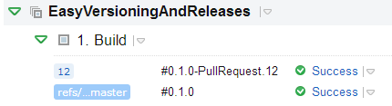

I do [a lot of open source](/open-source-work) and one common time sink across all projects is versioning and generating good release notes. This post is about two new open source tools. [https://github.com/Particular/GitVersion](https://github.com/Particular/GitVersion) and [https://github.com/JakeGinnivan/GitReleaseNotes](https://github.com/JakeGinnivan/GitReleaseNotes) which automate both of those things.

## Background
About 7 months ago I was talking with [Simon](https://github.com/simoncropp) about this pain and [Particular (the nServiceBus guys)](https://github.com/Particular) had already started on a tool which used the branching conventions of [GitFlow](http://nvie.com/posts/a-successful-git-branching-model/) to infer the [Semantic Version](http://semver.org/) of their software.

I was pretty excited about this, but did not want to convert all my projects to GitFlow just for versioning reasons. We had two choices, I could contribute GitHubFlow support to GitFlowVersion or spin off a new project. After a discussion with Simon and [Andreas](https://github.com/andreasohlund) we made the call that a separate project would be the way to start, then we can combine the best of both worlds later. [GitHubFlowVersion](https://github.com/JakeGinnivan/GitHubFlowVersion) was born.

Since then, GitHubFlowVersion and GitFlowVersion have joined forces bringing the best ideas from both projects into [GitVersion](https://github.com/Particular/GitVersion) which uses the conventions we use in common branching strategies to allow you to adopt [Semantic Versioning](http://semver.org) in your project really easily. I will talk more about release notes a bit later.

## GitVersion in action
I have created a simple repo which I will use for this post at [JakeGinnivan/EasyVersioningAndReleases](https://github.com/JakeGinnivan/EasyVersioningAndReleases) and also [setup a CI build](http://teamcity.ginnivan.net/project.html?projectId=OpenSourceProjects_EasyVersioningAndReleases&tab=projectOverview) (login as guest).

In this example I am going to use *GitVersion.exe* from my "build script", check out [Command line usage](https://github.com/Particular/GitVersion/wiki/Command-Line-Tool) on the GitVersion wiki for more ways you can use GitVersion.exe. Also check out the MSBuild task and the Ruby Gem.

Here is my sample build script, all it does is call GitVersion, parse the json and replace a __version__ token in my powershell module.

    $currentDir = Split-Path -Parent -Path $MyInvocation.MyCommand.Definition

    $output = . "$currentDir\GitVersion.1.0.0.0\tools\GitVersion.exe"

    $joined = $output -join "`n"
    $versionInfo = $joined | ConvertFrom-Json
    $version = $versionInfo.SemVer

    mkdir "$currentDir\Artifacts"

    Copy-Item "$currentDir\src\UsefulStuff.psm1" "$currentDir\Artifacts\UsefulStuff.psm1"

    (Get-Content "$currentDir\Artifacts\UsefulStuff.psm1") | 
        Foreach-Object {$_ -replace '__version__',"v$version"} |
        Out-File "$currentDir\Artifacts\UsefulStuff.psm1"
        
    Write-Output "##teamcity[buildNumber '$version']"

The json returned from GitVersion is a collection of variables, here is an example of what GitVersion returns

    {
      "Major":1,
      "Minor":0,
      "Patch":0,
      "PreReleaseTag":"beta.1",
      "PreReleaseTagWithDash":"-beta.1",
      "BuildMetaData":431,
      "FullBuildMetaData":"431.Branch.release-1.0.0.Sha.c1b1f80cd5e3e8182aa208163e40b4df66461226",
      "MajorMinorPatch":"1.0.0",
      "SemVer":"1.0.0-beta.1",
      "LegacySemVer":"1.0.0-beta1",
      "LegacySemVerPadded":"1.0.0-beta0001",
      "AssemblySemVer":"1.0.0.0",
      "FullSemVer":"1.0.0-beta.1+431",
      "InformationalVersion":"1.0.0-beta.1+431.Branch.release-1.0.0.Sha.c1b1f80cd5e3e8182aa208163e40b4df66461226",
      "ClassicVersion":"1.0.0.431",
      "ClassicVersionWithTag":"1.0.0.431-beta.1",
      "BranchName":"release-1.0.0",
      "Sha":"c1b1f80cd5e3e8182aa208163e40b4df66461226",
      "AssemblyVersion":"1.0.0.0",
      "AssemblyFileVersion":"1.0.0.0",
      "OriginalRelease":"c1b1f80cd5e3e8182aa208163e40b4df66461226.2014-05-11 08:42:24Z"
    }

We then just copy our powershell module into the output folder and replace the version. The last command `Write-Output "##teamcity[buildNumber '$version']"` updates TeamCity's build number. Resulting in:

That is GitVersion in action. You can also just invoke it directly as the first step in you TeamCity build. It also supports a few other build servers.

# Generating release notes
The next step in simplifying the maintenance of our open source (or internal) project is generating release notes.

There are two approaches you could take, try and keep your issue tracker and everything up to date so they can be generated from the issue tracker you use when you are release your software.

The second option is to keep your release notes in your repository, and you can edit and update them manually.
GitReleaseNotes works with either approach, but the recommended approach is the second one. Let's go through how you can use GitReleaseNotes.

**Note:** these examples are with GitHub, but GitReleaseNotes works with Jira and YouTrack currenly. TFS will also be supported. The main requirement is that you use Git as your VCS.

### Step 1
Install git release notes from Chocolatey, or download the zip and put into your PATH.

`cinst GitReleaseNotes`

### Step 2
Change directory to any git directory, then run `GitReleaseNotes /o ReleaseNotes.md`

This will generate some release notes:

 - [#11](https://github.com/JakeGinnivan/EasyVersioningAndReleases/pull/11) - Added function to load visual studio vars contributed by Jake Ginnivan ([JakeGinnivan](https://github.com/JakeGinnivan))
 - [#10](https://github.com/JakeGinnivan/EasyVersioningAndReleases/issues/10) - Add function to load VS 2013 variables +enhancement
 - [#9](https://github.com/JakeGinnivan/EasyVersioningAndReleases/pull/9) - Added project info contributed by Jake Ginnivan ([JakeGinnivan](https://github.com/JakeGinnivan))
 - [#8](https://github.com/JakeGinnivan/EasyVersioningAndReleases/issues/8) - Create something to version
 - [#7](https://github.com/JakeGinnivan/EasyVersioningAndReleases/pull/7) - Fixed header formatting contributed by Jake Ginnivan ([JakeGinnivan](https://github.com/JakeGinnivan))
 - [#1](https://github.com/JakeGinnivan/EasyVersioningAndReleases/issues/1) - Header formatted badly +fix

Commits: d3620015c9...61862ed9e8
 
------------------------

Not sure about you, but I think this is pretty handy.. So what has GitReleaseNotes actually done?

 - Seen that you have a Git remote pointing at GitHub
 - Connects to GitHub repository in remote and fetches issues and pull requests (for private you need to specify an auth token)
 - Outputs the closed pull requests and issues *since the last tag* to the *release notes*
 - If you have specified the `/alltags` switch then you will get issues grouped by release

You get included:

 - Link to the issue/pull request
 - Issue title
 - Tags (GitReleaseNotes follows [http://www.semanticreleasenotes.org/](http://www.semanticreleasenotes.org/) which uses `+tag` after the title for tags/categories/labels.
 - Shout outs - a really important part of release notes, calling out the awesome people which have contributed to your project! Shout outs are only available for pull requests, and will only be the person who submitted the pull request
 - Commit range included in that release (this will become a link to the diff of those commits if supported by the site)

As mentioned above, you could also be using another issue tracker and GitReleaseNotes would connect to it and fetch the issues!

### Step 3
Edit your release notes, if you only want to list pull requests just delete the issues. If you want to put both issue and pull request links in a single item, just do that.

### Step 4
If you are using the `/allTags` switch, then GitReleaseNotes will *append* new issues to your release notes. Meaning all your modifications will *not be changed* and new closed issues will simply be appended!

## Summary
Thats it, I would love feedback on both of these projects. I think they are massive time savers and I hope they save you some time!

I said I would come back to Particular's release note generator which can be found at [https://github.com/Particular/GitHubReleaseNotes](https://github.com/Particular/GitHubReleaseNotes).
It is much more strict and uses GitHub milestones and set tags to generate the release notes. Which allows high quality generated release notes. If you use GitHub milestones a lot for release planning, it might work better for you. Check it out.